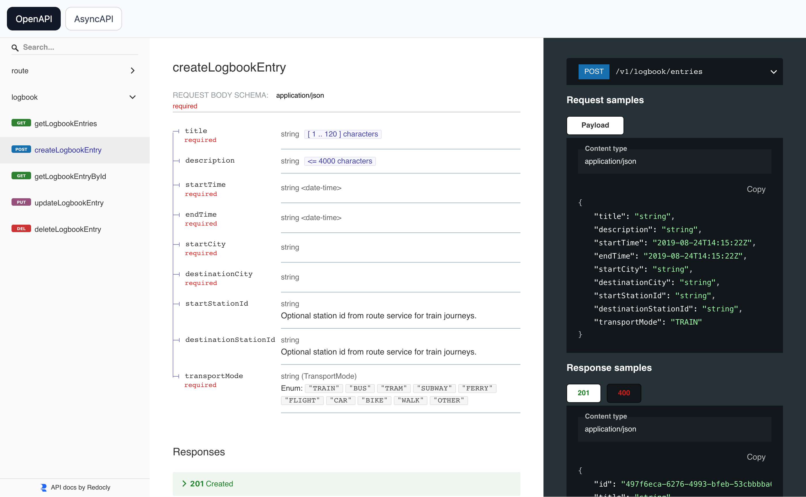
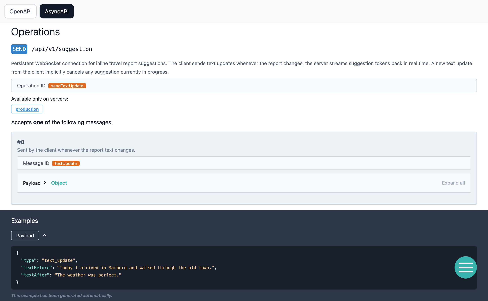

# API

## API Documentation

The API documentation is served as a web UI when deploying the system locally. See ["Deployment > Local"](deployment.md#local). Also each service exposes its own Swagger UI.

- [Full API Documentation (all services)](http://localhost:4570/)
- [Logbook Service (Swagger)](http://localhost:9100/api/swagger-ui/index.html)
- [Route Service (Swagger)](http://localhost:9200/api/swagger-ui/index.html)




## API Contract

Both async and REST endpoints are defined as openapi-like yaml files. They are used to generate both server and client code and can be found here:

- `/api/openapi.yaml`
- `/api/asyncapi.yaml`

## Generating Code

To re-generate all source files from the api specs run the following command:

```shell
sh api/scripts/generate_all.sh
```

### Client

```shell
sh api/scripts/generate_typescript.sh
```

### Server

```shell
sh api/scripts/generate_spring.sh
```

### GenAi

```shell
sh api/scripts/generate_python.sh
```
