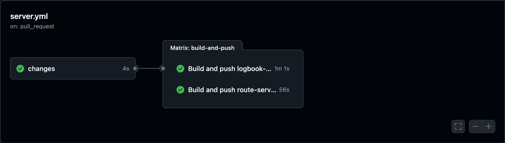
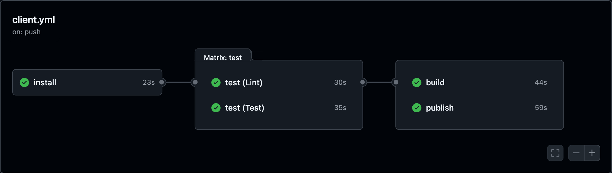
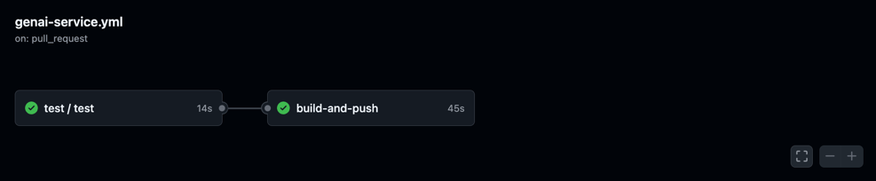

# CI/CD

The project contains a list of CI/CD pipelines that are implemented using GitHub Actions. All build workflows test and lint their subsystem, build the code, package the Dockerfile into an image and push the image to the GitHub Container Registry (ghcr). Deployment workflows run after merging to main and deploy the built images to the given environment. 

## [Build Server](https://github.com/AET-DevOps26/team-good-thing-i-like-my-builds-cancelled/actions/workflows/server.yml)

The server build workflow firstly checks for changes in one of the microservices. If changes are detected or the workflow has been triggered manually for a certain service, the action builds the Dockerfile of that service and pushes the image to the container registry.

## Run Server Tests

This workflow runs testing and linting for the Spring Boot microservices.

## [Build Client](https://github.com/AET-DevOps26/team-good-thing-i-like-my-builds-cancelled/actions/workflows/client.yml)

The client build action runs the following steps:
- install (installs npm packages if changed)
- test (runs workflow and component tests)
- lint (runs linter)
- build (builds the angular app)
- publish (packages the app into a docker image and pushes to ghcr)

## [Build GenAI](https://github.com/AET-DevOps26/team-good-thing-i-like-my-builds-cancelled/actions/workflows/genai-service.yml)

The GenAI build workflow builds the python app using the Dockerfile and pushes the image to the container registry.

## Run GenAI Tests

This workflow runs testing and linting for the GenAI python service.

## Deployment

Deployments to Kubernetes and Azure are automatically triggered after merging to `main`, as soon as build/push actions finish. For more details, see [Kubernetes/Azure in Deployment Docs](https://github.com/AET-DevOps26/team-good-thing-i-like-my-builds-cancelled/blob/main/docs/deployment.md#kubernetes).
