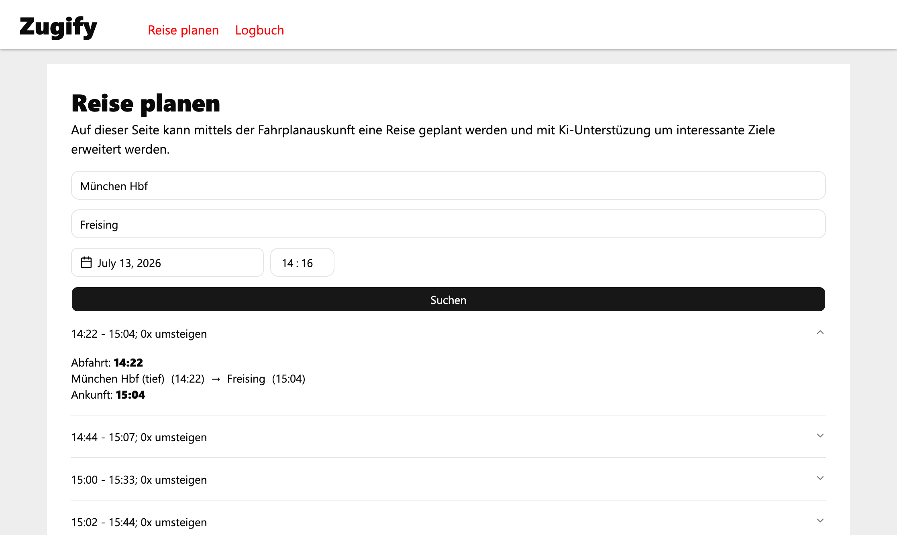
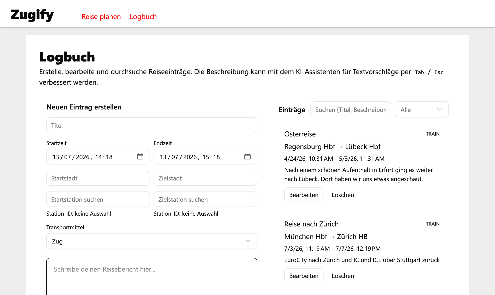
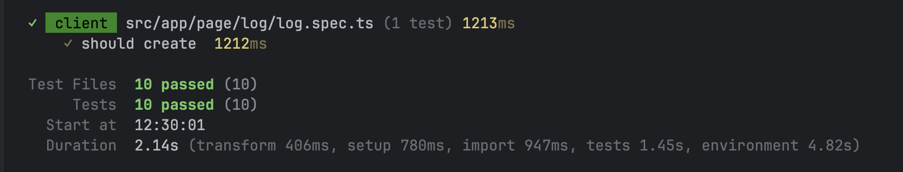

# Client

The client is built using [Angular](https://angular.dev/) and can be found in `/apps/client/`.

## Content

The UI offers a header used to navigate to one of the two pages "Route" and "Logbook".

### Route

The route UI allows the user to enter their start and destination station and departure time. After starting the search, the results will be fetched and displayed as a list of journeys below the input form.



### Logbook

In the logbook the users can create, modify, view and delete their past journeys. Using the input form the start and destination stations can be entered, the user can write a description about the trip using the AI features and can set the time and date of the journey.



## External UI Components

For components like the input fields, buttons and date selections the Angular library [ZardUI](https://zardui.com/) is being used. All components that are used from this are listed below and are typically imported by installing the source files in the git repo. They can be found in `src/app/shared/components/`.

Components:

- Accordion
- Badge
- Button
- Calendar
- Date Picker
- Input
- Input Group
- Loader
- Pagination
- Popover
- Select

## Testing

### Component Testing

Angular natively comes with a testing suite. Each component is being tested if it can be created to ensure correct imports, exports and dependencies. The two pages of the app (plan and log) have additional test cases that test the most important parts of the user workflow:
- `src/app/page/log/log.spec.ts`
- `src/app/page/plan/plan.spec.ts`

All tests can be executed using:

```shell
npm run test
```



### Linting

This project uses ESLINT with a custom config (`eslint.config.js`) to run linting on the TypeScript code. Linting can be executed locally using:

```shell
npm run lint
```
