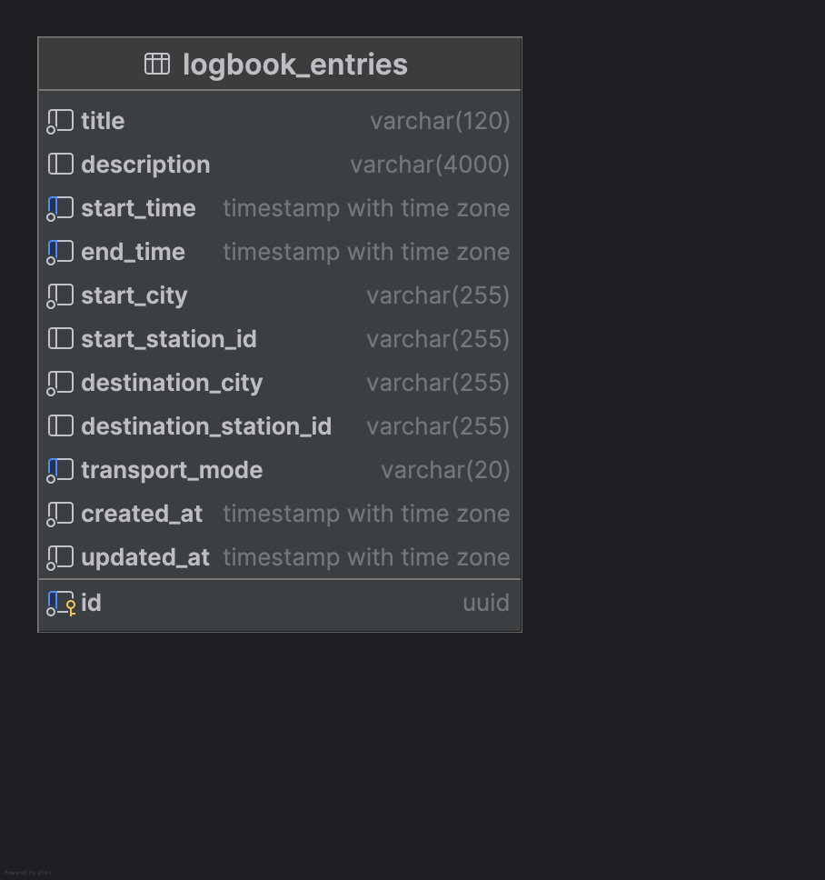

# Database

This project uses a PostgreSQL database to persist the data of the [Logbook Service](server.md).

## Schema

There is only one model that is being persisted: an entry in the logbook. The following graphic shows the schema of this model.

## Initialisation

The database stores the logbook and travel history for the users of the system. Therefore, no initial data is required for the app to function. The database schema and tables are automatically created when the logbook service is being started for the first time.

## Migration

Whenever the data model `.java` file in the logbook service changes simple migrations are automatically applied on the next startup of the service. The migration `.sql` files are generated into the `/src/main/resources/db.migration` directory of the logbook service and can be modified there for manual migration steps.
