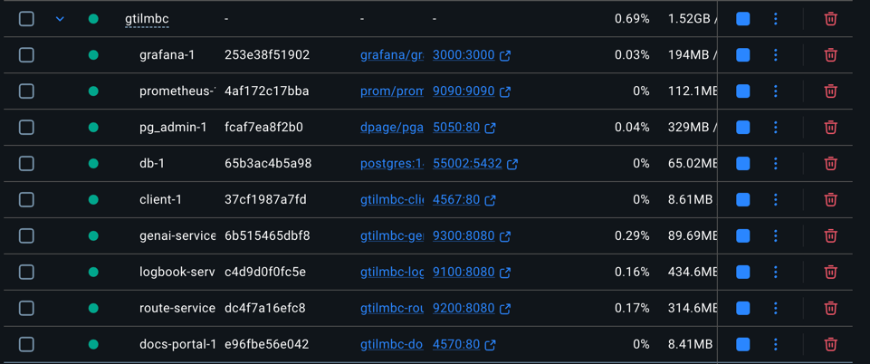

# Deployment

## Local

From the repository root, run:

```bash
./start-local.sh
```

What happens:
- If `LMSTUDIO_API_KEY` is missing, the script asks you to paste it once.
- When testing with Logos, this is the logos api key
- The key is saved to `infra/docker/compose/local/.env` for Docker Compose.
- All local images are built and containers are started.
- The merged docs portal opens at `http://localhost:4570`.

Stop everything:

```bash
docker compose -f infra/docker/compose/local/docker-compose.yml down
```




## Kubernetes

To deploy to Kubernetes, make sure you fulfill these **prerequisites**. Namespaces need to be created on [Rancher](https://rancher.ase.cit.tum.de/) to ensure they are created correctly (via code does not work according to course staff):
- Namespace `cancelled` with at least 3 GB RAM
- Namespace `cancelled-monitoring` with about 1 GB RAM
- Kubeconfig

### GitHub Workflow
Ensure GitHub Secrets are set correctly, especially that you provided a valid token in `K8S_TOKEN`. You can find the corresponding token in the kubeconfig file.

You can manually run the [workflow `deploy-k8s`](https://github.com/AET-DevOps26/team-good-thing-i-like-my-builds-cancelled/actions/workflows/deploy-k8s.yml), or trigger it by merging changes into `main`. It automatically creates the secrets in Kubernetes and deploys the latest versions of the `main` branch.

### Tools
Deployment to Kubernetes uses Helm for simplicity. In `infra/kubernetes/helm`, you can find all relevant files. An API Gateway is realized by an Ingress (actually, two, because monitoring uses a separare ingress due to the separate namespace), which maps API paths to the corresponding service that handles the request.

For TLS/HTTPS encryption we use Let's Encrypt, automatically set up by Kubernetes through the Ingress with corresponding annotation.


## Azure
Deployment to Azure also works via a [GitHub Workflow](https://github.com/AET-DevOps26/team-good-thing-i-like-my-builds-cancelled/actions/workflows/ansible-deploy.yml), also triggered when merging changes into the `main` branch. A separate workflow for Terraform ensures the VM is set up correctly.
