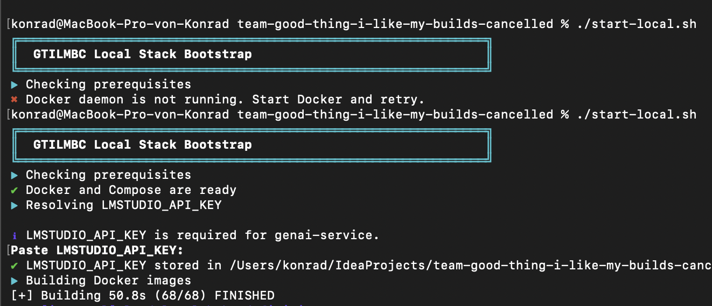

# Deployment

## Local

From the repository root, run:

```bash
./start-local.sh
```

What happens:
- If `LMSTUDIO_API_KEY` is missing, the script asks you to paste it once.
- When testing with Logos, this is the logos api key
- The key is saved to `infra/docker/compose/local/.env` for Docker Compose.
- All local images are built and containers are started.

Stop everything:

```bash
docker compose -f infra/docker/compose/local/docker-compose.yml down
```



## Kubernetes

## Azure
