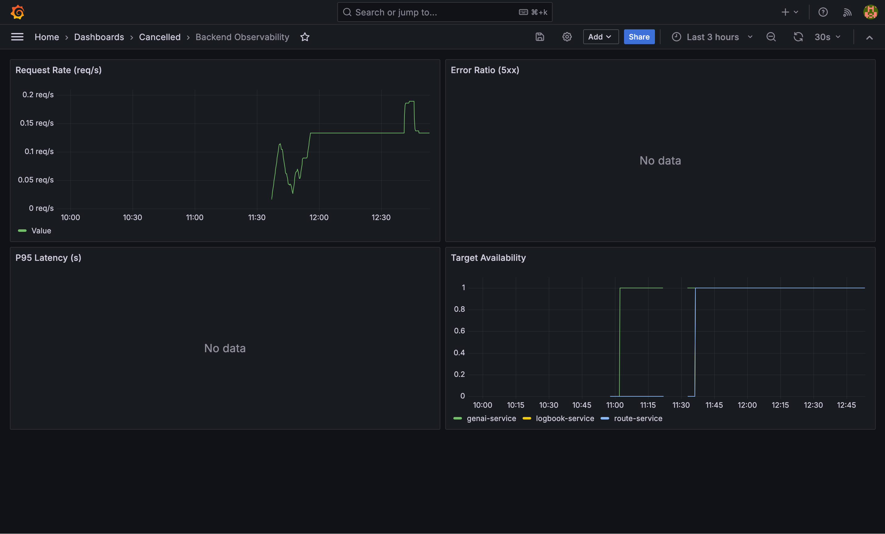
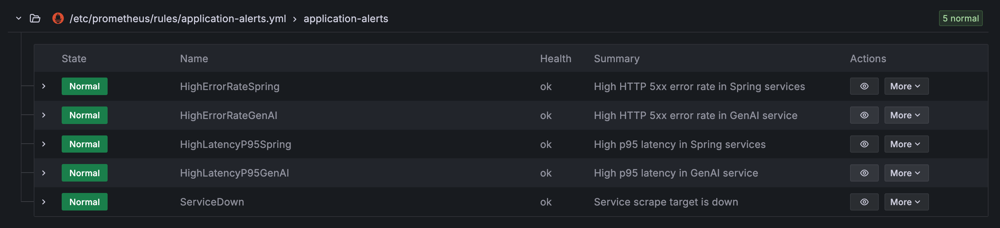

# Monitoring

Prometheus + Grafana is now integrated for all deployment modes:

- Local Docker Compose (`infra/docker/compose/local/docker-compose.yml`)
- Azure/Ansible deployment (`infra/ansible/templates/docker-compose.yml.j2` + `infra/ansible/playbooks/deploy.yml`)
- Kubernetes/Helm deployment (`infra/kubernetes/helm/templates/monitoring/monitoring-*.yml`)

The deployed monitoring can be found here:
- [Grafana](https://cancelled.stud.k8s.aet.cit.tum.de/monitoring/grafana/)
- [Prometheus](https://cancelled.stud.k8s.aet.cit.tum.de/monitoring/prometheus/)

## Collected Metrics

- `route-service` and `logbook-service`: Spring Boot Actuator Prometheus endpoint at `/actuator/prometheus`
- `genai-service`: FastAPI Prometheus endpoint at `/metrics`
- Core grading metrics are covered in dashboard/alerts:
    - request count
    - latency (p95)
    - error rate (5xx ratio)

## Alert Rules

Prometheus alert rules are defined in:

- `infra/monitoring/prometheus/rules/application-alerts.yml`

Implemented alerts:

- `HighErrorRate` (>5% 5xx for 10m)
- `HighLatencyP95` (p95 > 1s for 10m)
- `ServiceDown` (target unavailable for 2m)

## Dashboard Export

The exported dashboard JSON for submission is versioned in:

- `infra/monitoring/grafana/dashboards/backend-observability.json`

The same dashboard is also bundled in the Helm chart under:

- `infra/kubernetes/helm/files/grafana/backend-observability.json`

## Access

- Local/Ansible Prometheus: `http://<host>:9090`
- Local/Ansible Grafana: `http://<host>:3000` (default `admin/admin`)
- Kubernetes:
    - `kubectl -n monitoring port-forward svc/prometheus-service 9090:9090`
    - `kubectl -n monitoring port-forward svc/grafana-service 3000:3000`
